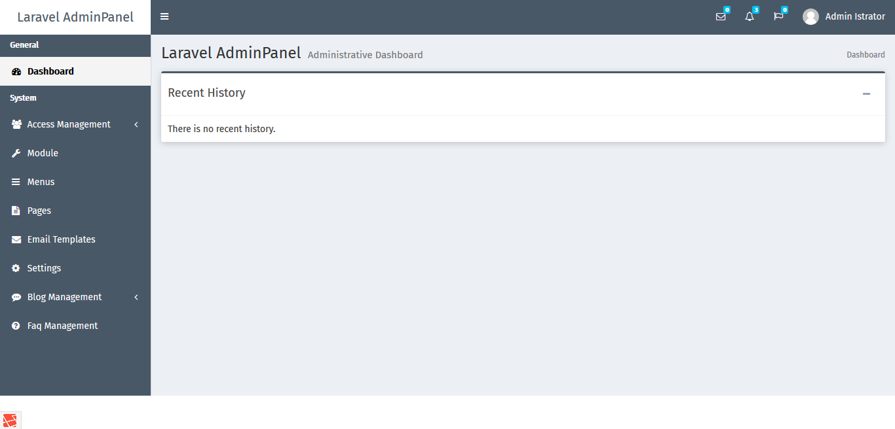

# Laravel
A tutorial related to Laravel
# laravel-adminpanel

## Introduction
* This is a laravel Admin Panel, based on [Rappasoft Laravel Boilerplate](https://github.com/rappasoft/laravel-5-boilerplate/releases/tag/4.5.7), with enhancemenets and many modules pre-made, just for you.
* The project is taken to Laravel 5.6 so we can develop from the latest Laravel.
* Article on our Admin Panel on CodeWall : [https://www.codewall.co.uk/the-laravel-admin-panel-that-you-need/](https://www.codewall.co.uk/the-laravel-admin-panel-that-you-need/)

## Features
For Laravel 5 Boilerplate Features : [Features](https://github.com/rappasoft/laravel-5-boilerplate/wiki#features)

## Additional Features
* Built-in Laravel Boilerplate Module Generator,
* Dynamic Menu/Sidebar Builder
* Roles Management Module
* CMS Pages Module
* Email Template Module
* Blog Module
* FAQ Module
* API Boilerplate.

## Built-in Laravel Boilerplate Module Generator
It gives you the ability to create a module using a sweet GUI, where you put in the Module Name and it will generate all the necessary files for you, like Model, Traits, Relationship, Migration, Controllers, Views and routes. So when you are done creating a module, you can directly go to the route generated and see your new module. Since, this does not have the ability to generate table fields for now, so you have to write the migration file that is generated and run a manual php artisan migrate command, and you are good to go.

## Installation

Please check the official laravel installation guide for server requirements before you start. [Official Documentation](https://laravel.com/docs/5.6/installation#installation)

Clone the repository

    git clone https://github.com/sabirali/laravel-adminpanel.git

Switch to the repo folder

    cd laravel-adminpanel

Copy the example env file and make the required configuration changes in the .env file

    cp .env.example .env

Install all the dependencies using composer

    composer install

Generate a new application key

    php artisan key:generate

Generate a new JWT secret key (If you want to use API)
    php artisan jwt:secret

Generate a new JWT authentication secret key

    php artisan jwt:secret

Run the database migrations (**Set the database connection in .env before migrating**)

    php artisan migrate

Run the database seeders

    php artisan db:seed

Install the javascript dependencies using npm

    npm install

Compile the dependencies

    npm run development

For generating the files of unisharp file manager

    php artisan vendor:publish --tag=lfm_public

For linking storage folder in public

    php artisan storage:link

Start the local development server

    php artisan serve

You can now access the server at http://localhost:8000

**TL;DR command list**

    git clone https://github.com/sabirali/laravel-adminpanel.git
    cd laravel-adminpanel
    cp .env.example .env
    composer install
    npm install
    npm run development
    php artisan storage:link
    php artisan key:generate
    php artisan jwt:secret
    php artisan vendor:publish --tag=lfm_public

## Logging In

`php artisan db:seed` adds three users with respective roles. The credentials are as follows:

* Admin Istrator: `admin@admin.com`
* Backend User: `executive@executive.com`
* Default User: `user@user.com`

Password: `1234`

## ScreenShots

## Dashboard

## User Listing

## Settings

## Simple Rest API Example With JWT(Json web token)
# Authentication

This applications uses JSON Web Token (JWT) to handle authentication. The token is passed with each request using the `Authorization` header with `Token` scheme. The JWT authentication middleware handles the validation and authentication of the token. Please check the following sources to learn more about JWT.

- https://jwt.io/introduction/
- https://self-issued.info/docs/draft-ietf-oauth-json-web-token.html

# For login

    POST http://localhost:8000/api/v1/auth/login 

**Request Parameter**
    email - admin@admin.com
    password - Admin@123

**Response**
    {
        "message": "Login Successfull.",
        "token": "adHRwOi8vd3d3LmdyYXZhdGFyLmNvbS9hdmF0YXIvNjRlMWI4ZDM0ZjQyNWQxOWUxZWUyZWE3MjM2ZDMwMjguanBnP3M9ODAmZD1tbSZyPWciLCJjb25maXJtZWQiOjEsInJlZ2lzdGVyZWRfYXQiOiIyMDE4LTA4LTE2VDA1OjU4OjM4KzAwOjAwIiwibGFzdF91cGRhdGVkX2F0IjoiMjAxOC0wOC0xNlQwNTo1ODozOCswMDowMCJ9.Cd6GA8_yenGW7y74auMxk3gPN6yO8EMA3qMVmkhghc0"
    }

## ScreenShots

# For user listing 

    POST http://localhost:8000/api/v1/login 

**Authorization**     
    Type : Bearer Token    

**Request Parameter**
    email - admin@admin.com
    password - Admin@123

**Response**
    You get the users list.

## ScreenShots

## Issues

If you come across any issues please report them [here](https://github.com/sabirali/laravel-adminpanel/issues).

## Contributing
Feel free to create any pull requests for the project.

## License

[MIT LICENSE](https://github.com/sabirali/laravel-adminpanel/blob/master/LICENSE.txt)
